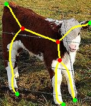
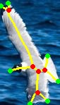

## Introduction

Blumnet is an skeleton detector based on DETR and DeformableDETR. It treats the skeleton as graph, detects skeleton 
curves, endpoints and junctions, and reconstructs graphs.  

## Citation

```
@article{Zhang2022BlumNet,
title={BlumNet: Graph Component Detection for Object Skeleton Extraction},
author={Zhang, Yulu and Sang, Liang and Grzegorzek, Marcin and See, John and Yang, Cong},
booktitle={ACM International Conference on Multimedia},
pages={5527-5536},
year={2022}
}
```

## License

This project is released under the [Apache 2.0 license](./LICENSE).


## Usage


### 1. Install requirements

* Linux, CUDA>=10.2, GCC>=5.4, Python>=3.8

We recommend you to use Anaconda to create a conda environment:
```bash
conda create -n blumnet python=3.8
conda activate blumnet
```

* PyTorch>=1.8, torchvision>=0.9 (following instructions [here](https://pytorch.org/))

For example, you could install pytorch and torchvision as following:
```bash
conda install pytorch=1.9.0 torchvision=0.10.0 cudatoolkit=10.2 -c pytorch
```

* Other requirements
```bash
pip install -r requirements.txt
```

### 2. Compile CUDA operators

This is for [deformable transformer](https://github.com/fundamentalvision/Deformable-DETR).
```bash
cd ./models/ops
sh ./make.sh
# unit test (should see all checking is True)
python test.py
```

### 3. Download backbone weights

Download the weights for backbones:
```bash
bash detection/download_backbones.sh

tree models/pretrained/ # check files
```
Make sure you get these files for pretrained backbone weights 

    models/pretrained/
    ├── swin_base_patch4_window12_384_22k.pth
    └── swin_small_patch4_window7_224.pth
    └── vgg16_caffe-292e1171.pth

### 4. Prepare datasets

Please download sk1491 from [GoogleDrive](https://drive.google.com/file/d/11ya3dDYnbiUEAElz9aZVnf6aN5uTg77F/view?usp=sharing) and organize them as following:

```
code_root/
└── datasets/
    └── sk1491/
        ├── test/
        ├── train/
            ├── im
            ├── gt
            └── train_pair.lst
```

We also provide the other datasets' links: [sk506](https://drive.google.com/file/d/1qJMyxQspNG59jJJrQKLLbq0MyhtGHJkR/view?usp=sharing), [SymPASCAL](https://drive.google.com/file/d/1AWIpN7AKFtyE2wiE6Ly7R_yjXjsN9m--/view?usp=sharing), [WH-SYMMAX](https://drive.google.com/file/d/1tMRuLLMm_T1qokkjXz_moocTPZAfeXcr/view?usp=sharing). Note that these datasets' format is a bit  different
from their official version, the `png/jpg` files are extracted from original `.mat` files. As the groundtruth of formal datasets do not distinguish skeletons between multiple objects, we add some stitched images to sk1491, so that we could get more than one skeleton graphs per image. Based on this augmentation, it's easy
to try Blumnet on multi-skeletons situation. We name the augmentated dataset [sk1491_mix](https://drive.google.com/file/d/1yWhQo-W8uZ-pZ3jaoe2SfyzCb16xZ2fY/view?usp=sharing).  

For China mainland researchers, we provide downloading link of datasets on [Baidu YunPan](https://pan.baidu.com/s/1wlXumDSDst3nITcadR3Z8g), its passward is `p7fw`.

### 5. Training and Eval

```bash
cd $BLUMNET
# start training
bash detection/train_gcd.sh

# eval F1-score
bash detection/test_gcd.sh

# show graph component of testset
bash detection/visualise_gcd.sh
```

### 6. Results and trained models.

| Backbone | sk506 | sk1491 | WH-SYMMAX | SymPASCAL |
| ----- | ----- | ----- | ----- | ----- |
| VGG16 |    [0.750](https://drive.google.com/file/d/1-VGnFsY6hdDuM4zQIqaN3SN5Z4D92_ne/view?usp=sharing)   |  [0.792](https://drive.google.com/file/d/1z-avpDtns4FQyxEvKqouhrc_g1y2Y1kN/view?usp=sharing) |   [0.873](https://drive.google.com/file/d/1uwRrU_rGcd1sM05yL9qdguglP-pApg4f/view?usp=sharing)    |   [0.515](https://drive.google.com/file/d/1zuPn5ISeVUo6OjOu-qifABcdYkCS2XQI/view?usp=sharing)    |
| SwinBase |   [0.752](https://drive.google.com/file/d/1BJCpYE20UQwpSN_vdxkpNFipl5kNH3aW/view?usp=sharing)    |  [0.826](https://drive.google.com/file/d/1dl_-sSPHlwnPCxs0lrpMV92qeZ4QNKdd/view?usp=sharing)     |  [0.877](https://drive.google.com/file/d/15knLAJ19OkS4humxc1NlMuZRGms7gYCM/view?usp=sharing)     |   [0.521](https://drive.google.com/file/d/1miK6wbjGWEQVFzh7Pt7WIPa5QqIRCtvI/view?usp=sharing)    |


## Test demo 

step 1 download the [blumnet(swin_small)](https://drive.google.com/file/d/1OmFjTMOvfJAmSXa5kMcWe6i8q_Pm8yNE/view?usp=sharing) and save it as bellow:
```
code_root/
└── exps/
    └── demo
        └── checkpoint.pth
```

step 2 run test on demo image
```bash
cd $BLUMNET
python test.py
```
The visualised image is generated in `datasets/demo_rst/`. As bellow, demo1 and demo2 show 2 skeleton graph components inferred from Blumnet, demo3 shows all the branches collected from curves and points. 

| Demo1 | Demo2 | Demo3 |
| ------- | ------- | ------- | 
|  |  |  |

## Reference

1. [Adalsn](https://github.com/sunsmarterjie/SDL-Skeleton)
2. [DETR](https://github.com/facebookresearch/detr)
3. [DeformableDETR](https://github.com/fundamentalvision/Deformable-DETR)
4. [SwinTransformer](https://github.com/microsoft/Swin-Transformer)
5. [HistogramSegmentation](https://github.com/judelo/2007-TIP-HistogramSegmentation)


